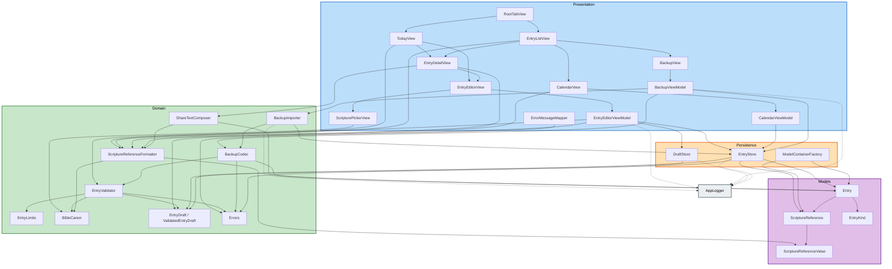

# 컴포넌트 의존 관계 (Component Dependency)

**단계**: INCEPTION / Application Design
**작성일**: 2026-08-20

---

## 1. 계층 의존 규칙

1. 의존은 Presentation → Domain → Persistence → Models 방향으로만 흐른다.
2. Models는 어떤 계층도 참조하지 않는다.
3. Domain은 Presentation 타입(SwiftUI, ViewModel)을 참조하지 않는다.
4. Persistence는 Presentation을 참조하지 않는다. Domain 값 타입은 참조한다.
5. Support(로깅)는 모든 계층에서 호출 가능하지만 상위 계층 타입을 참조하지 않는다.
6. 순환 의존은 허용하지 않는다.

**Persistence가 Domain을 참조하는 예외**: `EntryStore`는 `ValidatedEntryDraft`와
`ValidatedBackupRecord`를 매개변수로 받는다. 검증된 값만 저장소에 도달하게 하려는
의도적 선택이며(SEC-04), 방향은 여전히 상위(Domain) → 하위(Persistence) 호출이다.
저장소가 도메인 로직을 실행하지는 않는다.

---

## 2. 의존 그래프



### 텍스트 대안

```
Presentation
  RootTabView -> TodayView, EntryListView
  TodayView -> EntryEditorView, EntryDetailView, ScriptureReferenceFormatter
  EntryListView -> EntryDetailView, CalendarView, BackupView, Formatter
  EntryDetailView -> EntryEditorView, ShareTextComposer, Formatter
  EntryEditorView -> EntryEditorViewModel, ScripturePickerView
  ScripturePickerView -> BibleCanon
  CalendarView -> CalendarViewModel, Formatter
  BackupView -> BackupViewModel
  ErrorMessageMapper -> Errors

  EntryEditorViewModel -> EntryValidator, EntryStore, DraftStore, EntryDraft
  CalendarViewModel -> EntryStore
  BackupViewModel -> BackupImporter, BackupCodec, EntryStore

Domain
  EntryValidator -> EntryLimits, BibleCanon, Draft types, Errors
  ScriptureReferenceFormatter -> BibleCanon, ScriptureReferenceValue
  ShareTextComposer -> Formatter, Entry
  BackupCodec -> EntryValidator, Errors, Entry
  BackupImporter -> BackupCodec, EntryStore

Persistence
  EntryStore -> Entry, ScriptureReference, ValidatedEntryDraft, Errors
  ModelContainerFactory -> Entry, ScriptureReference
  DraftStore -> EntryDraft

Models
  Entry -> EntryKind, ScriptureReference
  ScriptureReference -> ScriptureReferenceValue

Support (점선: 단방향 호출, 반환값 없음)
  EntryEditorViewModel, BackupViewModel, EntryStore, BackupImporter,
  DraftStore -> AppLogger
```

---

## 3. 의존 매트릭스

행이 열을 의존한다. `O` = 직접 의존, `-` = 의존 없음.

| 의존 주체 \ 대상 | Models | EntryStore | DraftStore | Validator | Canon | Formatter | Codec | Importer | Errors | AppLogger |
|---|---|---|---|---|---|---|---|---|---|---|
| TodayView | O | - | - | - | - | O | - | - | - | - |
| EntryListView | O | - | - | - | - | O | - | - | - | - |
| EntryDetailView | O | O | - | - | - | O | - | - | O | - |
| EntryEditorView | O | - | - | - | - | - | - | - | O | - |
| EntryEditorViewModel | O | O | O | O | - | - | - | - | O | O |
| ScripturePickerView | - | - | - | - | O | - | - | - | - | - |
| CalendarView | O | - | - | - | - | O | - | - | O | - |
| CalendarViewModel | O | O | - | - | - | - | - | - | O | - |
| BackupView | - | - | - | - | - | - | - | - | O | - |
| BackupViewModel | - | O | - | - | - | - | O | O | O | O |
| ErrorMessageMapper | - | - | - | - | - | - | - | - | O | - |
| EntryValidator | O | - | - | - | O | - | - | - | O | - |
| ScriptureReferenceFormatter | O | - | - | - | O | - | - | - | - | O |
| ShareTextComposer | O | - | - | - | - | O | - | - | - | - |
| BackupCodec | O | - | - | O | - | - | - | - | O | - |
| BackupImporter | - | O | - | - | - | - | O | - | O | O |
| EntryStore | O | - | - | - | - | - | - | - | O | O |
| ModelContainerFactory | O | - | - | - | - | - | - | - | - | - |
| DraftStore | O | - | - | - | - | - | - | - | - | O |
| Models | - | - | - | - | - | - | - | - | - | - |

**순환 검증**: 매트릭스에서 상삼각(하위 → 상위) 방향 의존이 없다. `EntryStore`가
`Validator`를 의존하지 않고, `Validator`가 `EntryStore`를 의존하지 않는 것이 핵심이다.
순환 없음을 확인했다.

---

## 4. 통신 패턴

| 관계 | 패턴 | 비고 |
|---|---|---|
| View → ViewModel | `@Observable` 관찰 + 메서드 호출 | 단방향 데이터 흐름 |
| View → SwiftData | `@Query` 선언적 조회 | 데이터 변경 시 자동 갱신 |
| ViewModel → EntryStore | 동기 메서드 호출, `throws` | `@MainActor` 고정 |
| ViewModel → Domain 순수 타입 | 정적 함수 호출, `Result` 또는 `throws` | 상태 없음 |
| BackupImporter → EntryStore | 동기 메서드 호출, 트랜잭션 경계 위임 | 단일 반영 지점 |
| 모든 계층 → AppLogger | 단방향 통보, 반환값 없음 | 실패해도 흐름에 영향 없음 |
| Domain → Presentation | **없음** | 콜백·델리게이트도 두지 않음 |

**알림 체계를 두지 않는 이유**: 데이터 변경 전파는 SwiftData와 `@Query`가 담당한다.
`NotificationCenter`나 별도 이벤트 버스를 추가하면 갱신 경로가 두 개가 되어 어느 쪽이
화면을 갱신했는지 추적하기 어려워진다.

---

## 5. 데이터 흐름

### 5.1 쓰기 흐름

```
사용자 입력
    |
    v
EntryDraft (원본 값, 검증 전)
    |
    | EntryValidator.validate
    v
ValidatedEntryDraft (정규화 완료)
    |
    | EntryStore.insert / update
    v
Entry + ScriptureReference (SwiftData 저장)
    |
    | @Query 자동 갱신
    v
목록 화면 반영
```

### 5.2 읽기 흐름 (목록)

```
SwiftData 저장소
    |
    | @Query(predicate: filter, sort: date desc)
    v
Entry 배열
    |
    | 뷰에서 날짜별 그룹화
    | ScriptureReferenceFormatter로 참조 문자열화
    v
화면 표시
```

### 5.3 읽기 흐름 (캘린더)

```
SwiftData 저장소
    |
    | EntryStore.dayMarkers(월 범위 프레디케이트)
    v
[Date: DayMarker]  (해당 월만)
    |
    v
CalendarViewModel.markers
    |
    v
월 격자 표식 렌더링

날짜 선택 시:
    EntryStore.entries(on: day) -> 선택 날짜 목록 표시
```

### 5.4 백업 흐름

```
내보내기:
    EntryStore.allEntries -> BackupCodec.encode -> Data -> 파일 저장

가져오기:
    파일 -> Data -> BackupCodec.decode -> BackupDocument
                        |
                        v
                 BackupCodec.validate -> [ValidatedBackupRecord]
                        |
                        v
                 EntryStore.applyImport (단일 트랜잭션)
                        |
                        v
                 BackupImportSummary
```

---

## 6. 테스트 경계

| 테스트 대상 | 필요 환경 | 이유 |
|---|---|---|
| `EntryValidator` | 없음 (순수 함수) | 값 입력 → `Result` 출력 |
| `ScriptureReferenceFormatter` | 없음 | 값 입력 → 문자열 출력 |
| `BibleCanon.search` | 없음 | 정적 데이터 조회 |
| `ShareTextComposer` | `Entry` 인스턴스 | 인메모리 컨테이너로 생성 |
| `BackupCodec` | 없음 (encode는 `Entry` 필요) | 디코딩·검증은 순수 |
| `EntryStore` | 인메모리 `ModelContainer` | 실제 쿼리·정렬·cascade 검증 |
| `BackupImporter` | 인메모리 `ModelContainer` | 트랜잭션·롤백 검증 |
| `DraftStore` | 임시 디렉터리 | 파일 쓰기·읽기 검증 |
| ViewModel | 인메모리 컨테이너 + 임시 디렉터리 | 상태 전이 검증 |
| 화면 흐름 | 시뮬레이터 (XCUITest) | 작성·조회·삭제·캘린더 전환 |

**Q3=B 결정의 결과**: 가짜 저장소 구현이 없으므로 저장소 테스트는 실제 SwiftData
동작을 검증한다. 대신 인메모리 컨테이너 생성 비용이 테스트마다 발생한다. 이 앱 규모에서
문제가 되지 않는 수준이다.

---

## 7. 단위별 구현 순서와 의존

| 단위 | 구현 대상 | 선행 요구 |
|---|---|---|
| Unit 1 | Models, Persistence, Domain(Validation·Scripture·Errors), Support | Xcode 프로젝트 생성 |
| Unit 2 | Presentation(Root·Today·EntryList·EntryDetail·EntryEditor), Domain/Sharing, Shared | Unit 1 완료 |
| Unit 3 | Presentation(Calendar·Backup), Domain/Backup | Unit 1 완료, Unit 2의 EntryListView·EntryDetailView 존재 |

Unit 3이 Unit 2를 의존하는 지점은 두 곳이다. `EntryListView`에 보기 전환 컨트롤과 백업
진입점을 추가해야 하고, 캘린더에서 선택한 기록이 `EntryDetailView`로 이동해야 한다.
