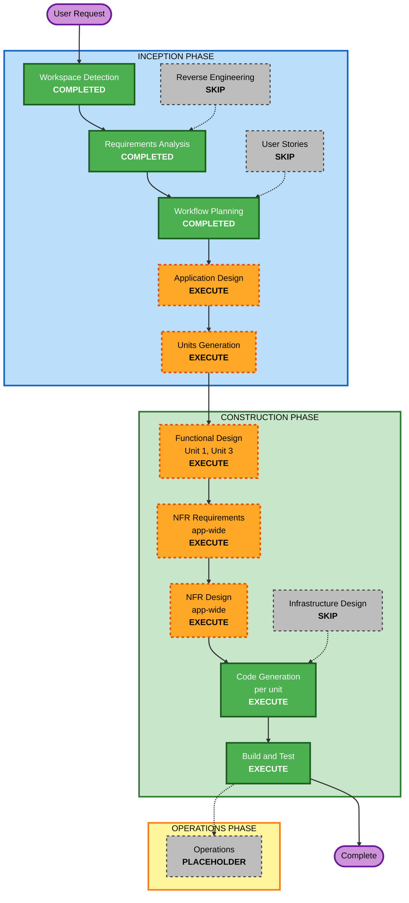

# 실행 계획 (Execution Plan)

**단계**: INCEPTION / Workflow Planning
**작성일**: 2026-08-20
**프로젝트**: 묵담 (mukdam) — 기도제목·묵상 기록 iOS 앱
**입력**: `aidlc-docs/inception/requirements/requirements.md`,
`aidlc-docs/inception/requirements/requirement-verification-questions.md`

---

## 1. 상세 분석 요약

### 1.1 변경 범위

Greenfield 신규 프로젝트다. 기존 코드가 없어 변환 범위(Transformation Scope) 분석과
컴포넌트 관계 매핑은 해당하지 않는다.

| 항목 | 내용 |
|---|---|
| 산출물 | iOS 앱 1개 (SwiftUI, iOS 17+) |
| 기능 요구사항 | 13건 (FR-01 ~ FR-13) |
| 비기능 요구사항 | 12건 (NFR-01 ~ NFR-12) |
| 보안 요구사항 | 11건 (SEC-01 ~ SEC-11) |
| 외부 시스템 | 없음 |
| 서버·인프라 | 없음 |

### 1.2 변경 영향 평가

| 영향 영역 | 해당 | 설명 |
|---|---|---|
| 사용자 노출 변경 | 예 | 앱 전체가 신규 사용자 경험. 2탭 구조, 작성·조회·캘린더·공유·백업 |
| 구조적 변경 | 예 | 앱 계층 구조를 새로 정의(모델, 저장소, 도메인 서비스, 뷰) |
| 데이터 모델 변경 | 예 | Entry, ScriptureReference 신규 정의. CloudKit 전방 호환 제약 적용 |
| API 변경 | 아니오 | 네트워크 API 없음. 백업 JSON 파일 스키마가 유일한 외부 계약 |
| NFR 영향 | 예 | 성능(NFR-01, 02, 12), 접근성(NFR-06), 보안(SEC-01~11) |
| 인프라 영향 | 아니오 | 클라우드 리소스, 네트워크 구성, 배포 파이프라인 없음 |
| 운영 영향 | 아니오 | 중앙 로깅·모니터링·알림 없음 |

### 1.3 위험도 평가

| 항목 | 판정 | 근거 |
|---|---|---|
| 위험도 | **Low** | 신규 프로젝트, 단일 사용자, 외부 연동 없음, 마이그레이션 대상 데이터 없음 |
| 롤백 복잡도 | **Easy** | Git 커밋 단위 되돌리기로 충분. 운영 중 데이터 없음 |
| 테스트 복잡도 | **Moderate** | 도메인 로직 단위 테스트는 단순. UI 테스트와 백업 왕복 검증에 시뮬레이터 필요 |

**주의가 필요한 지점 3가지**

1. **CloudKit 전방 호환** — iCloud 동기화를 다음 버전에 넣기로 했으므로 MVP 모델부터
   SwiftData + CloudKit 제약을 지켜야 한다. 어기면 다음 버전에서 스키마
   마이그레이션이 필요하다.
2. **백업 가져오기** — 외부 파일을 저장소에 반영하는 유일한 경로이며, 실패 시 전체
   롤백이 요구된다(FR-12, SEC-05). 부분 반영이 발생하면 데이터 정합성이 깨진다.
3. **Xcode 프로젝트 생성** — 사용자가 직접 수행하는 선행 작업이다(D-21). 완료 전에는
   빌드 검증을 할 수 없다.

---

## 2. 워크플로우 시각화



### 텍스트 대안

```
INCEPTION PHASE
  Workspace Detection ......... COMPLETED
  Reverse Engineering ......... SKIP (Greenfield)
  Requirements Analysis ....... COMPLETED
  User Stories ................ SKIP (단일 페르소나)
  Workflow Planning ........... COMPLETED
  Application Design .......... EXECUTE
  Units Generation ............ EXECUTE (3개 단위)

CONSTRUCTION PHASE (단위별 반복)
  Unit 1: 데이터 및 도메인 기반
    Functional Design ......... EXECUTE
    NFR Requirements .......... EXECUTE (앱 전체 범위)
    NFR Design ................ EXECUTE (앱 전체 범위)
    Infrastructure Design ..... SKIP
    Code Generation ........... EXECUTE
  Unit 2: 기록 작성 및 조회 화면
    Functional Design ......... SKIP
    NFR Requirements .......... SKIP (Unit 1 문서로 커버)
    NFR Design ................ SKIP (Unit 1 문서로 커버)
    Infrastructure Design ..... SKIP
    Code Generation ........... EXECUTE
  Unit 3: 캘린더 및 백업
    Functional Design ......... EXECUTE
    NFR Requirements .......... SKIP (Unit 1 문서로 커버)
    NFR Design ................ SKIP (Unit 1 문서로 커버)
    Infrastructure Design ..... SKIP
    Code Generation ........... EXECUTE
  Build and Test .............. EXECUTE (모든 단위 완료 후)

OPERATIONS PHASE
  Operations .................. PLACEHOLDER
```

---

## 3. 실행할 단계와 근거

### 🔵 INCEPTION PHASE

- [x] **Workspace Detection** — COMPLETED
- [x] **Reverse Engineering** — SKIPPED
  - **근거**: 워크스페이스에 애플리케이션 코드가 없는 Greenfield 프로젝트다.
- [x] **Requirements Analysis** — COMPLETED
  - **근거**: FR 13건, NFR 12건, SEC 11건, 확정 결정 27건 문서화 완료.
- [x] **User Stories** — SKIPPED
  - **근거**: 페르소나가 단일(소모임 참여 크리스천)이고 관리자 역할이 없다. 개발
    인원 1명이라 팀 간 이해 공유 목적이 약하다. FR-01~FR-13에 이미 완료 조건이
    포함되어 스토리가 요구사항을 재서술하는 수준에 그친다.
- [x] **Workflow Planning** — IN PROGRESS (본 문서)
- [ ] **Application Design** — **EXECUTE**
  - **근거**: 신규 프로젝트로 컴포넌트가 하나도 정의되어 있지 않다. 저장소 계층,
    도메인 서비스(검증·참조 문자열화·백업 직렬화), 뷰 모델의 경계를 먼저 정해야
    한다. 특히 SEC-10(검증·직렬화·저장 로직을 UI에서 분리)과 NFR-08(단위 테스트
    가능한 구조)은 계층 경계를 문서로 확정하지 않으면 지켜지지 않는다.
  - **깊이**: Standard. 컴포넌트 책임, 주요 메서드 시그니처, 의존 방향까지.
- [ ] **Units Generation** — **EXECUTE**
  - **근거**: FR 13건을 한 번에 구현하고 검증하면 되돌릴 지점이 없다. 데이터 계층 →
    기본 화면 → 부가 기능 순으로 3개 단위로 나누면 각 단위 끝에서 동작하는 앱을
    확인할 수 있다. 단위 간 의존 방향도 단순하다.
  - **깊이**: Minimal~Standard. 단위 3개와 의존 관계, 단위별 FR 매핑.

### 🟢 CONSTRUCTION PHASE

- [ ] **Functional Design** — **EXECUTE (Unit 1, Unit 3)** / **SKIP (Unit 2)**
  - **Unit 1 실행 근거**: SwiftData 모델 정의, CloudKit 전방 호환 제약 적용, 검증
    규칙(내용 트림, 절 범위, 길이 상한), 참조 문자열화 규칙, 66권 정적 데이터 구조를
    코드 작성 전에 확정해야 한다.
  - **Unit 3 실행 근거**: 백업 JSON 스키마, 스키마 버전 정책, 병합 규칙(추가 vs 교체,
    중복 판별), 전체 롤백 방식, 캘린더 월 범위 조회 규칙은 설계 판단이 필요하다.
  - **Unit 2 건너뛰기 근거**: 화면 조립과 내비게이션 중심이며, 동작 규칙은 FR-01,
    FR-02, FR-06~FR-10의 완료 조건으로 이미 명시되어 있다. 새로운 비즈니스 규칙이
    없다.
- [ ] **NFR Requirements** — **EXECUTE (Unit 1에서 앱 전체 범위로 1회)** / **SKIP (Unit 2, Unit 3)**
  - **실행 근거**: 보안 확장 규칙을 적용하기로 했으므로(D-24) SEC-01~SEC-11을 구체적
    구현 수단으로 내려야 한다(파일 보호 속성, 로깅 정책, 입력 길이 상한 수치, 오류
    노출 정책). 성능 목표(NFR-01, 02, 12)와 접근성 목표(NFR-06)의 검증 방법도 정해야
    한다. 기술 스택은 이미 확정(D-01, D-20)되어 있으므로 스택 선정은 다루지 않는다.
  - **건너뛰기 근거**: NFR은 앱 전체에 걸친 횡단 관심사다. 단위마다 반복하면 같은
    내용을 세 번 쓰게 된다. Unit 1에서 앱 전체 범위로 1회 작성하고 이후 단위는 이를
    참조한다.
- [ ] **NFR Design** — **EXECUTE (Unit 1에서 앱 전체 범위로 1회)** / **SKIP (Unit 2, Unit 3)**
  - **실행 근거**: NFR Requirements에서 정한 목표를 구현 패턴으로 옮긴다(오류 처리
    패턴, fail-closed 저장 흐름, 로깅 래퍼, 접근성 구현 패턴, 목록 성능 패턴).
  - **건너뛰기 근거**: NFR Requirements와 동일.
- [ ] **Infrastructure Design** — **SKIP**
  - **근거**: 클라우드 리소스, 서버, 네트워크 구성, 배포 파이프라인이 모두 없다.
    산출물은 기기에서 동작하는 앱 하나이며 App Store 제출은 MVP 구현 범위 밖이다.
    매핑할 인프라 서비스가 존재하지 않는다.
- [ ] **Code Generation** — **EXECUTE (단위별, 필수 단계)**
  - **근거**: 실제 구현. 단위마다 Part 1 계획 승인 후 Part 2 생성.
- [ ] **Build and Test** — **EXECUTE (필수 단계)**
  - **근거**: `xcodebuild`로 빌드, 단위 테스트, UI 테스트 실행 지침을 만들고 검증한다
    (D-22, NFR-09).

### 🟡 OPERATIONS PHASE

- [ ] **Operations** — PLACEHOLDER
  - **근거**: 현재 자리표시자 단계다. App Store 제출과 배포는 별도 작업으로 다룬다.

---

## 4. 작업 단위 구성 (Units Generation 단계에서 확정)

아래는 Units Generation 단계에서 확정할 초안이다.

```
+-----------------------------------------------------------------+
|  Unit 1: 데이터 및 도메인 기반                                  |
|                                                                 |
|  - SwiftData 모델 (Entry, ScriptureReference)                   |
|  - 저장소 계층 (조회, 저장, 삭제)                               |
|  - 검증 로직 (내용, 제목, 장/절 범위, 개수 상한)                |
|  - 참조 문자열화 (FR-05)                                        |
|  - 성경 66권 정적 데이터 및 약칭 검색 (FR-04)                   |
|                                                                 |
|  FR: FR-04, FR-05 / 데이터 모델 / SEC-01, 04, 07, 10            |
+-----------------------------------------------------------------+
                              |
              +---------------+---------------+
              |                               |
              v                               v
+---------------------------------+  +---------------------------------+
|  Unit 2: 기록 작성 및 조회      |  |  Unit 3: 캘린더 및 백업         |
|                                 |  |                                 |
|  - 2탭 구조 (오늘 / 기록)       |  |  - 월간 캘린더 보기 (FR-13)     |
|  - 작성 진입 분리 (FR-01)       |  |  - 보기 전환 통합 (FR-07)       |
|  - 기도제목/묵상 작성           |  |  - JSON 백업 내보내기 (FR-11)   |
|    (FR-02, FR-03)               |  |  - JSON 백업 가져오기 (FR-12)   |
|  - 오늘 화면 (FR-06)            |  |                                 |
|  - 목록 및 필터 (FR-07)         |  |  SEC: 02, 05, 06                |
|  - 상세/수정/삭제 (FR-08, 09)   |  |  NFR: 12                        |
|  - 1건 공유 (FR-10)             |  |                                 |
+---------------------------------+  +---------------------------------+
```

**의존 관계**

- Unit 2 → Unit 1 (모델, 저장소, 검증, 참조 문자열화 필요)
- Unit 3 → Unit 1 (동일)
- Unit 3 → Unit 2 (기록 탭 보기 전환 통합, 상세 화면 진입 재사용)

**구현 순서**: Unit 1 → Unit 2 → Unit 3 (순차). 병렬 실행 이점이 없는 규모다.

---

## 5. 사용자 선행 작업

| 순서 | 작업 | 시점 | 비고 |
|---|---|---|---|
| 1 | 번들 식별자 결정 | Unit 1 Code Generation 시작 전 | 예: `com.<본인식별자>.mukdam` |
| 2 | Xcode에서 iOS 앱 프로젝트 생성 | Unit 1 Code Generation 시작 전 | 정확한 설정값과 단계는 해당 시점에 안내 |
| 3 | App Store 앱 이름 중복 확인 | 제출 전까지 언제든 | 구현에는 영향 없음 |

**중요**: 2번이 완료되기 전에는 빌드·테스트 검증을 수행할 수 없다. Unit 1 Code
Generation의 Part 1 계획 단계에서 프로젝트 생성 절차를 먼저 안내한다.

---

## 6. 진행 규모

실제 소요 시간은 검토 속도에 따라 달라지므로 시간 대신 단계 수로 표기한다.

| 구간 | 남은 단계 | 승인 지점 |
|---|---|---|
| INCEPTION 잔여 | Application Design, Units Generation | 2 |
| Unit 1 | Functional Design, NFR Requirements, NFR Design, Code Generation(계획+생성) | 5 |
| Unit 2 | Code Generation(계획+생성) | 2 |
| Unit 3 | Functional Design, Code Generation(계획+생성) | 3 |
| 마무리 | Build and Test | 1 |
| **합계** | **11개 단계** | **13개 승인 지점** |

---

## 7. 성공 기준

**주요 목표**: 계정 없이 기기 안에서 동작하며, 날짜와 성경 구절 참조가 함께 남는
기도제목·묵상 기록 앱을 iOS 17 이상 iPhone에서 실행 가능한 상태로 완성한다.

**핵심 산출물**

- 워크스페이스 루트에 SwiftUI 앱 소스 코드
- 도메인 로직 단위 테스트, 주요 화면 UI 테스트
- 빌드 및 테스트 실행 지침 문서
- 단계별 설계 문서 (`aidlc-docs/`)

**품질 게이트**

1. `xcodebuild` 빌드가 경고 없이 성공한다.
2. FR-01 ~ FR-13의 완료 조건이 전부 충족된다.
3. 단위 테스트와 UI 테스트가 전부 통과한다.
4. 백업 JSON 내보내기 → 가져오기 왕복에서 기록 건수와 내용이 일치한다.
5. 손상된 백업 파일을 가져와도 기존 데이터가 변경되지 않는다.
6. SEC-01 ~ SEC-11이 코드에 반영된다.
7. VoiceOver로 기록 목록, 상세, 캘린더 날짜를 읽을 수 있다.
8. SwiftData 모델이 CloudKit 제약(기본값·옵셔널, 유니크 제약 없음)을 지킨다.

---

## 8. 보안 규칙 준수 요약 (Workflow Planning 단계)

| 규칙 | 판정 | 근거 |
|---|---|---|
| SECURITY-01 | 적용 대상 확인 | Unit 1 Functional Design과 NFR Design에서 파일 보호 속성 설계 예정 |
| SECURITY-02 | N/A | 네트워크 중개 장비 없음 |
| SECURITY-03 | 적용 대상 확인 | NFR Design에서 로깅 정책 설계 예정 |
| SECURITY-04 | N/A | HTML 제공 엔드포인트 없음 |
| SECURITY-05 | 적용 대상 확인 | Unit 1(입력 검증), Unit 3(백업 파일 검증) 설계 예정 |
| SECURITY-06 | N/A | 클라우드 IAM 리소스 없음 |
| SECURITY-07 | N/A | 네트워크 리소스 없음 |
| SECURITY-08 | N/A | 서버 엔드포인트 없음, 단일 사용자 |
| SECURITY-09 | 적용 대상 확인 | NFR Design에서 오류 노출 정책 설계 예정 |
| SECURITY-10 | 적용 대상 확인 | Code Generation에서 의존성 정책 적용 예정 |
| SECURITY-11 | 준수 | 계층 분리를 Application Design 실행 근거로 명시. 오용 시나리오(조작된 백업 파일)를 Unit 3 Functional Design 범위에 포함 |
| SECURITY-12 | 부분 적용 | 인증 기능 없음. 자격 증명 하드코딩 금지는 Code Generation에서 적용 |
| SECURITY-13 | 적용 대상 확인 | Unit 3 Functional Design에서 역직렬화 안전성 설계 예정 |
| SECURITY-14 | N/A | 중앙 로그·알림 인프라 없음 |
| SECURITY-15 | 적용 대상 확인 | NFR Design에서 예외 처리·fail closed 패턴 설계 예정 |

**Blocking Security Findings**: 없음
